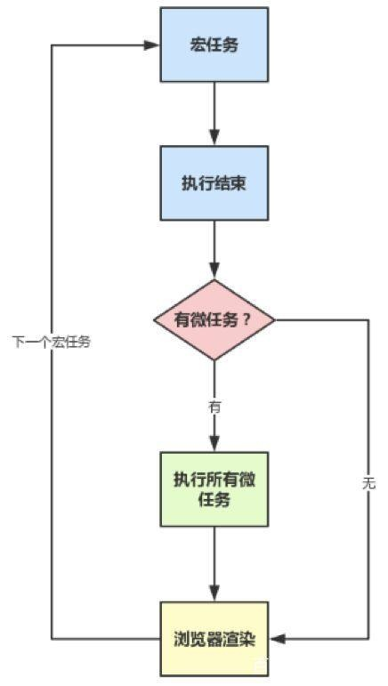

### 宏任务与微任务
宏任务包括：script ， setTimeout ，setInterval ，setImmediate ，I/O ，UI rendering  
微任务包括：process.nextTick ，promise ，MutationObserver

### 流程如下：
1. 在event loop中，有宏任务队列和微任务队列，浏览器首先执行的是宏任务队列里的第一个宏任务
2. 在一个宏任务执行完之后，会去清空微任务队列（依次执行所有的微任务），在此期间如果产生了新的宏任务则添加到宏任务队列中，如果产生的新的微任务则添加到微任务队列中并在此次执行，直至微任务队列被清空
3. 然后执行浏览器渲染操作，在开始执行下一个宏任务，以此闭环进行

### 流程图：


### 一些例子
``` javascript 
Promise.resolve().then(() => {
  console.log('promise1')
  setTimeout(() => {
    console.log('setTimeout1')
  })
})
setTimeout(() => {
  console.log('setTimeout2')
  Promise.resolve().then(() => {
    console.log('promise2')
  })
})

// 在 chrome 浏览器下的执行结果是：
// promise1 - setTimeout2 - promise2 - setTimeout1
```